<div align="center">

```
  ██████╗  ██╗██╗  ██╗██╗███████╗████████╗     █████╗ ██╗     ██████╗ ███████╗
 ██╔════╝  ██║██║  ██║██║██╔════╝╚══██╔══╝    ██╔══██╗██║    ██╔═══██╗██╔════╝
 ╚█████╗   ██║██║  ██║██║█████╗     ██║       ███████║██║    ██║   ██║███████╗
  ╚═══██╗  ██║██║  ██║██║██╔══╝     ██║       ██╔══██║██║    ██║   ██║╚════██║
 ██████╔╝  ██║╚█████╔╝██║██║        ██║       ██║  ██║██║    ╚██████╔╝███████║
 ╚═════╝   ╚═╝ ╚════╝ ╚═╝╚═╝        ╚═╝       ╚═╝  ╚═╝╚═╝     ╚═════╝ ╚══════╝
```

### ⚡ Autonomous Multi-Agent AI Operating System

*An intelligent, self-orchestrating personal AI Operating System designed for complex reasoning, autonomous software engineering, tool execution, multi-model routing, and knowledge retrieval.*

---

[](https://fastapi.tiangolo.com/)
[](https://reactjs.org/)
[](https://www.typescriptlang.org/)
[](https://www.python.org/)
[](https://www.langchain.com/)
[](https://tailwindcss.com/)

---

</div>

> [!NOTE]
> **PERSONAL & NON-COMMERCIAL USE NOTICE**
> 
> **Swift AI OS** is a **personalized, non-commercial research & engineering project** created and developed by **Rishabh** ([@rishabhtcodes](https://github.com/rishabhtcodes)). It is built strictly for personal productivity, experimentation, and educational demonstration. It is **NOT** intended for commercial resale, SaaS monetization, or corporate deployment by third parties.

---

## 🌌 Overview

**Swift AI OS** acts as an autonomous personal engineering AI operating system (JARVIS-class system). Unlike standard single-chat interfaces, Swift AI OS deploys a **graph of 14 specialized AI agents** that work together concurrently to analyze, decompose, design, code, test, document, and deploy full applications.

<br />

<div align="center">
  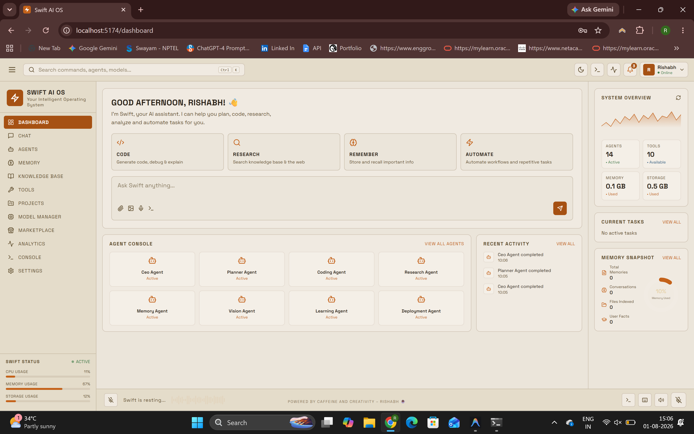
  <p><i>Figure 1: Swift AI OS Central Command Dashboard & Agent Telemetry</i></p>
</div>

<br />

---

## 🏛️ System Architecture

### 1. Multi-Agent Orchestration Flow (LangGraph Execution Pipeline)

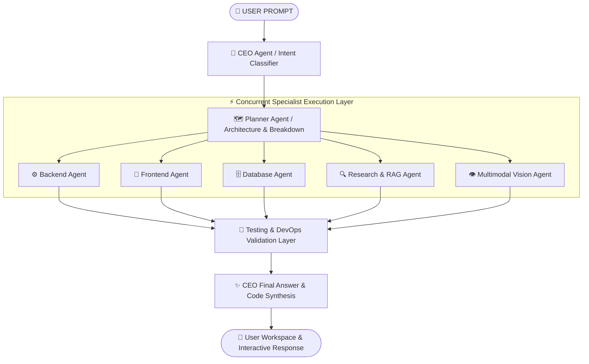

### 2. High-Level System Architecture & Component Interactions

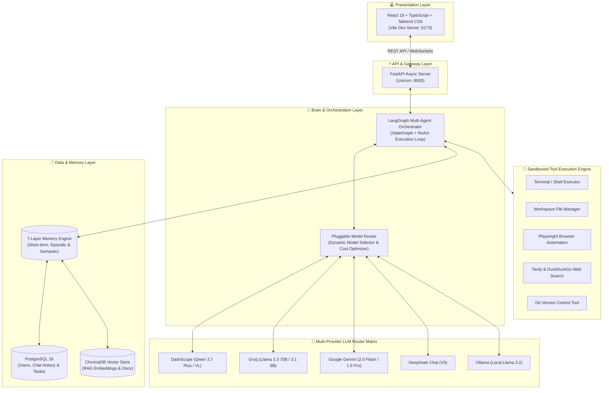

---

## 🤖 The 14 Specialist Agents

Every agent operates with explicit status tracking, execution logs, memory retrieval, and sandboxed tool access:

1. 👑 **CEO Agent** — High-level intent analysis, delegation, and final answer synthesis.
2. 🗺️ **Planner Agent** — Architecture design, sprint breakdown, and dependency resolution.
3. 💻 **Coding Agent** — Core multi-language software engineering and file generation.
4. ⚙️ **Backend Agent** — FastAPI microservices, REST APIs, and dependency injection.
5. 🎨 **Frontend Agent** — React 18, TypeScript, Tailwind CSS, and Framer Motion components.
6. 🗄️ **Database Agent** — PostgreSQL schemas, indexes, and vector store configurations.
7. 🧪 **Testing Agent** — Automated unit test suites (PyTest / Jest / Vitest).
8. 🚀 **Deployment Agent** — Vercel, Render, and production build pipelines.
9. 🛡️ **DevOps Agent** — Dockerfiles, `docker-compose.yml`, and CI/CD security.
10. 🔍 **Research Agent** — Real-time web scraping, browser automation, and document synthesis.
11. 👁️ **Vision Agent** — Multimodal image analysis using Qwen VL & Gemini Vision.
12. 🧠 **Memory Agent** — Multi-tiered memory indexing (short-term, long-term, semantic).
13. 🎓 **Learning Agent** — Continuous self-improvement and lesson extraction.
14. 📝 **Docs Agent** — OpenAPI specs, architecture documentation, and README generation.

---

## 🔌 Pluggable Model Router & Manager

No single model is hardcoded. Swift AI OS dynamically routes tasks based on capabilities (**reasoning**, **coding**, **vision**, **planning**, **RAG**, **translation**):

- 🔴 **DashScope / Qwen**: `qwen3.7-plus`, `qwen-vl-plus`, `qwen-plus`
- ⚡ **Groq**: `llama-3.3-70b-versatile`, `llama-3.1-8b-instant`, `mixtral-8x7b-32768`
- ♊ **Google Gemini**: `gemini-2.0-flash`, `gemini-1.5-pro`
- 🐋 **DeepSeek**: `deepseek-chat` (V3)
- 🦙 **Ollama**: Local models (`llama3.2`)
- 🤖 **OpenAI & Anthropic**: `gpt-4o`, `claude-3.5-sonnet` (Optional via keys)

---

## 💻 Tech Stack & Architecture

```
Swift AI OS Architecture
├── Frontend (React 18 + Vite + TypeScript + TailwindCSS + TanStack Query + Framer Motion)
├── Backend (Python 3.12 + FastAPI + SQLAlchemy 2.0 Async + Pydantic v2)
├── Multi-Agent Engine (LangGraph + Custom Tool Loop + Model Router)
├── Storage & Vector DB (PostgreSQL 16 + pgvector + Redis + ChromaDB)
└── Execution Sandbox (Workspace Filesystem + Python Executor + Subprocess Shell)
```

---

## 🚀 Quickstart & One-Click Launch

### Single-Command Startup (Windows / Linux / macOS)

Run the automated launcher script from the root directory:

**Windows (CMD / PowerShell):**
```cmd
.\start-swift.bat
```
*(Or in PowerShell: `.\start-swift.ps1`)*

**Linux / macOS:**
```bash
chmod +x start-swift.sh
./start-swift.sh
```

This automatically initializes database tables, seeds default model registries, starts the FastAPI backend on `http://localhost:8000`, and launches the Vite frontend on `http://localhost:5173`.

---

## 🌐 Application Navigation & Visual Showcase

| Page | URL Route | Description |
|---|---|---|
| **Dashboard** | `/dashboard` | System overview, active agent runs, CPU/Memory telemetry |
| **Chat / Assistant** | `/chat` | Interactive multi-agent conversational interface |
| **Agents** | `/agents` | Overview & live status of all 14 specialist agents |
| **Memory** | `/memory` | Semantic, conversation, and project memory inspector |
| **Knowledge Base** | `/knowledge` | RAG document upload (PDF, Word, TXT, GitHub, Web URLs) |
| **Tools** | `/tools` | Sandboxed tools catalog and execution runner |
| **Projects** | `/projects` | Kanban task board, workspace file tree, and sprint progress |
| **Model Manager** | `/models` | Pluggable LLM health checks, latency, priorities, and cost |
| **Marketplace** | `/marketplace` | Discover community plugins, agent extensions, and tools |
| **Analytics** | `/analytics` | Token usage breakdown, cost tracking, latency metrics |
| **Developer Console**| `/console` | Real-time trace logs, active tool logs, shell runner |
| **Settings** | `/settings` | Provider API keys configuration & system parameters |

---

---

## 🖼️ System Screenshots Gallery Grid

<div align="center">

<table>
  <tr>
    <td width="50%" align="center">
      <b>📊 Command Dashboard</b><br/><br/>
      <a href="docs/Screenshots/dashboard.png">
        
      </a>
      <p><i>System Overview, Telemetry & Quick Prompts</i></p>
    </td>
    <td width="50%" align="center">
      <b>🎛️ Multi-Agent Orchestration</b><br/><br/>
      <a href="docs/Screenshots/agents.png">
        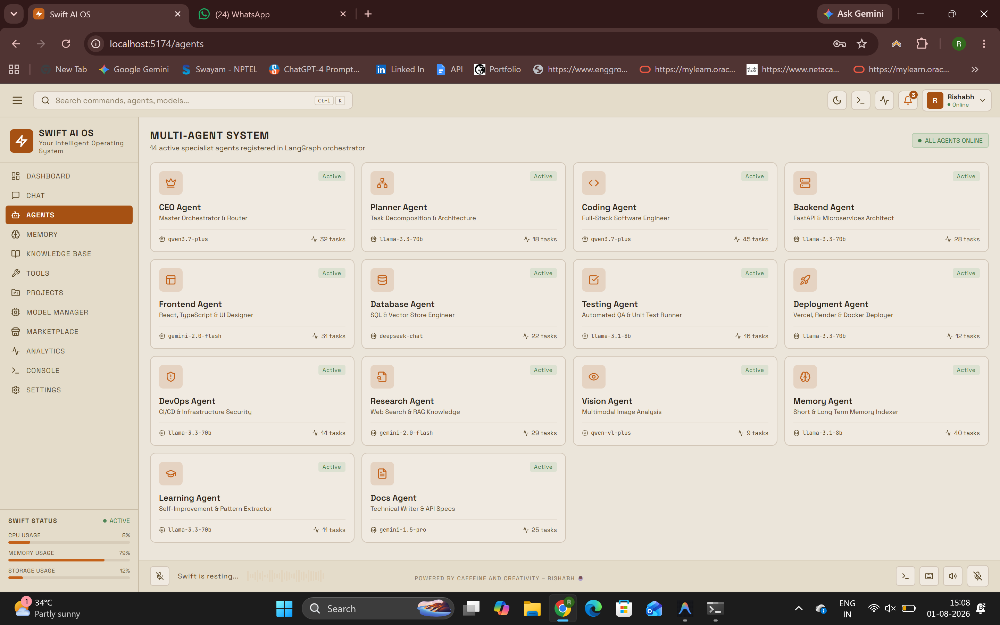
      </a>
      <p><i>14 Specialist Agents & Model Routing Status</i></p>
    </td>
  </tr>
  <tr>
    <td width="50%" align="center">
      <b>💬 Conversational Agent Interface</b><br/><br/>
      <a href="docs/Screenshots/chat.png">
        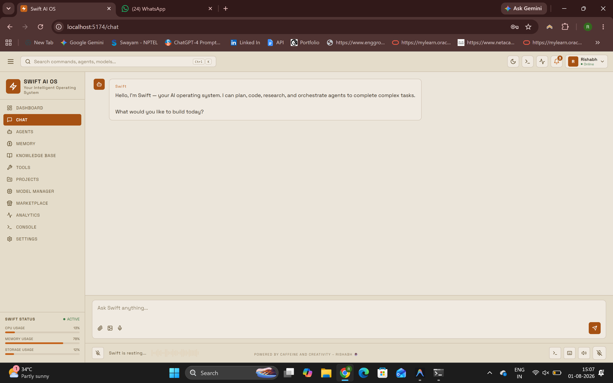
      </a>
      <p><i>Multi-Turn Interactive Chat & Execution Stream</i></p>
    </td>
    <td width="50%" align="center">
      <b>🧠 7-Layer Memory System</b><br/><br/>
      <a href="docs/Screenshots/memory.png">
        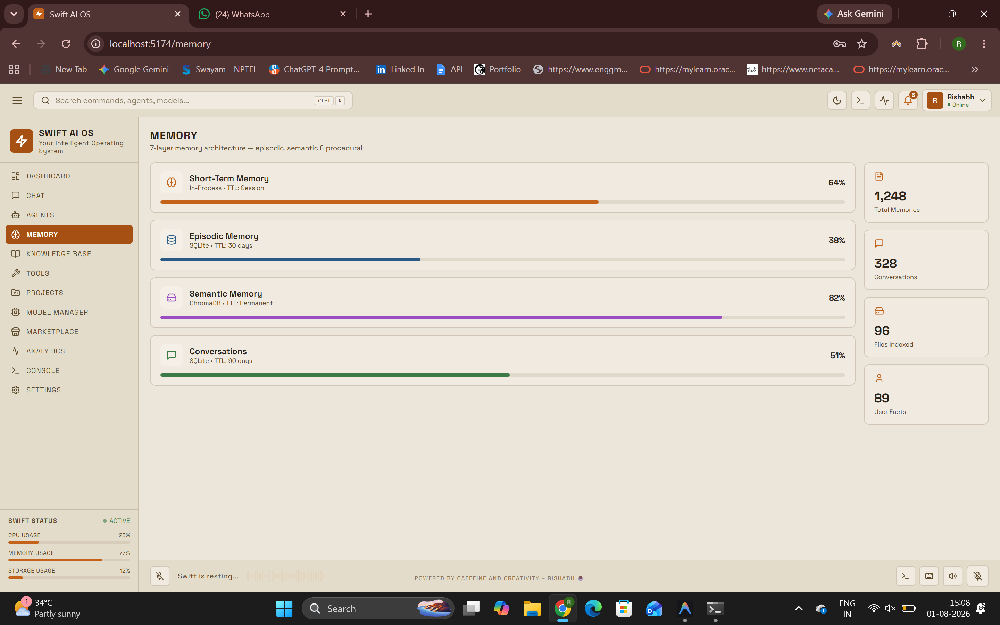
      </a>
      <p><i>Episodic, Semantic & Session Memories</i></p>
    </td>
  </tr>
  <tr>
    <td width="50%" align="center">
      <b>📚 Vector RAG Knowledge Base</b><br/><br/>
      <a href="docs/Screenshots/knowledge.png">
        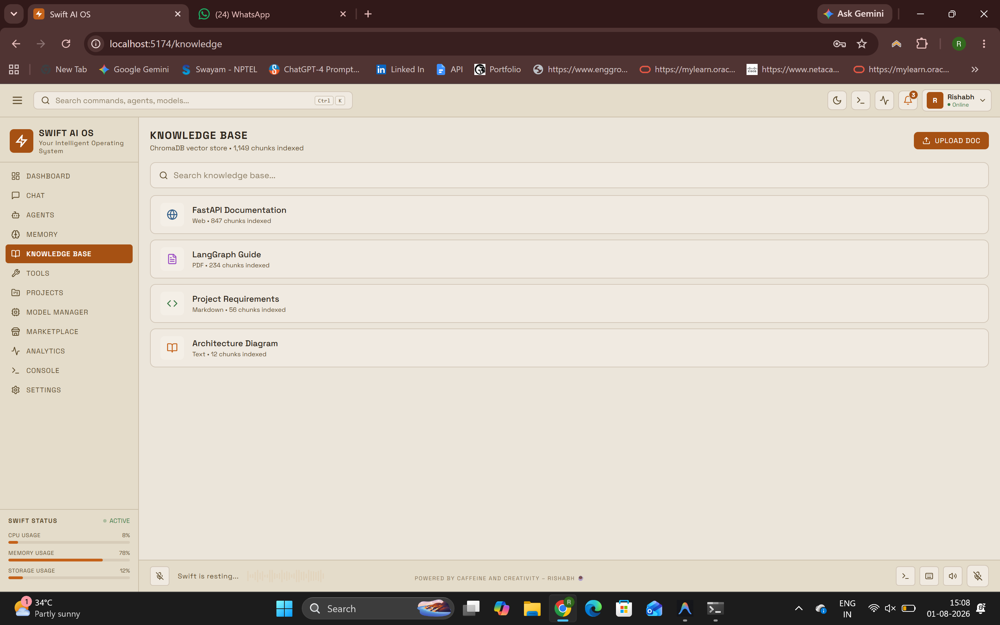
      </a>
      <p><i>ChromaDB Vector Store & Document Ingestion</i></p>
    </td>
    <td width="50%" align="center">
      <b>🧰 Sandboxed Tool Execution Hub</b><br/><br/>
      <a href="docs/Screenshots/tools.png">
        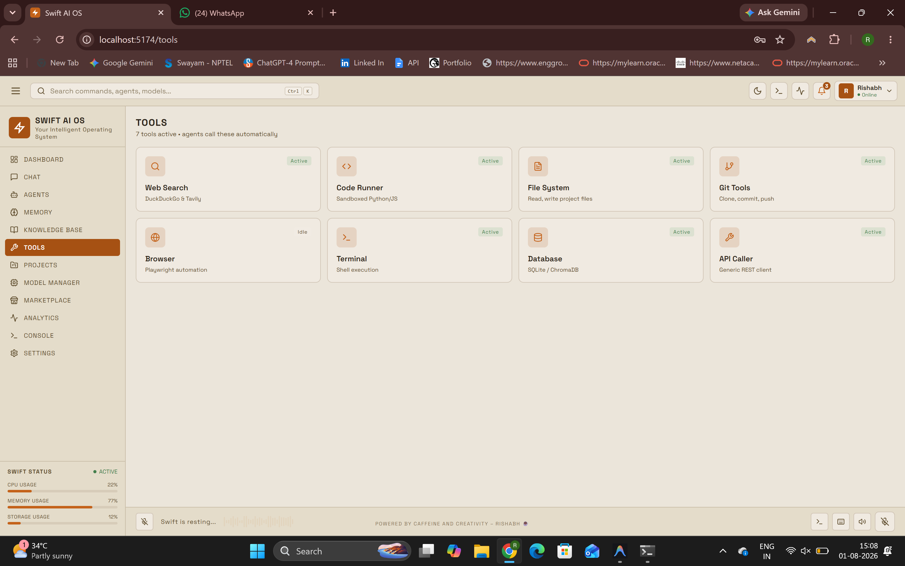
      </a>
      <p><i>Browser, Terminal, Git & Python Executors</i></p>
    </td>
  </tr>
  <tr>
    <td width="50%" align="center">
      <b>📁 Project & Workspace Manager</b><br/><br/>
      <a href="docs/Screenshots/projects.png">
        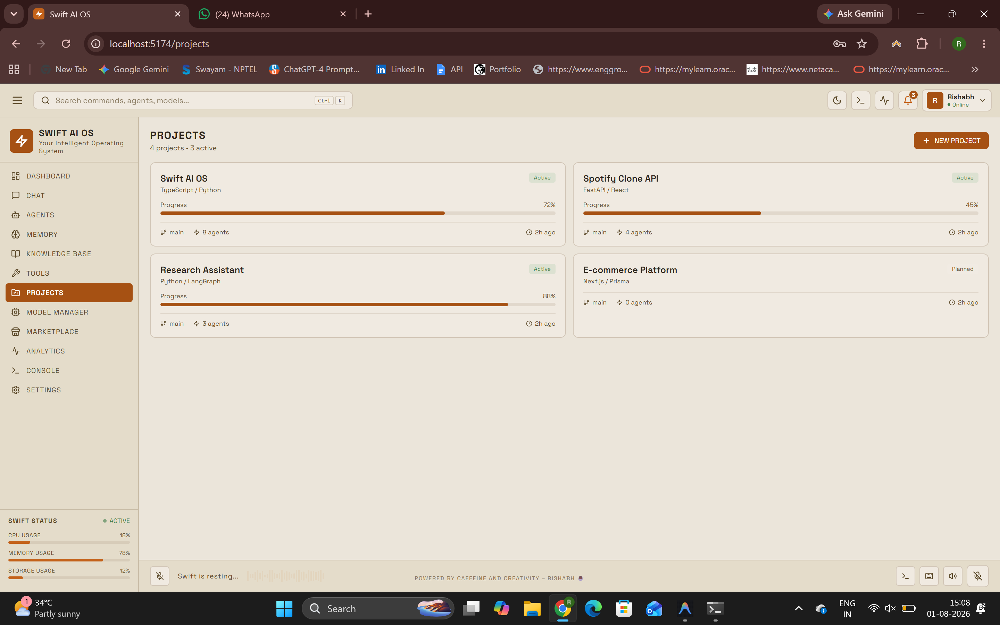
      </a>
      <p><i>Kanban Board & Sprint Workspaces</i></p>
    </td>
    <td width="50%" align="center">
      <b>🔌 Pluggable Model Manager</b><br/><br/>
      <a href="docs/Screenshots/model-manager.png">
        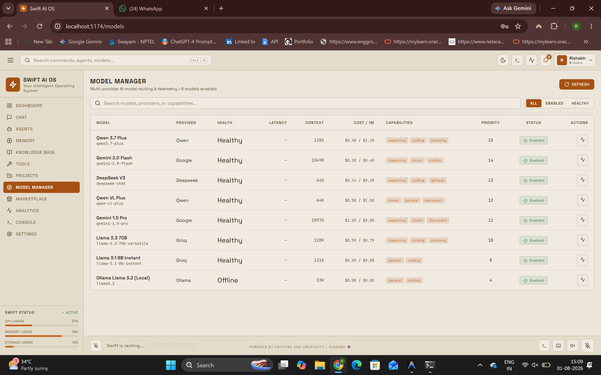
      </a>
      <p><i>Multi-Provider Router & Latency Telemetry</i></p>
    </td>
  </tr>
  <tr>
    <td width="50%" align="center">
      <b>🧩 Agent & Plugin Marketplace</b><br/><br/>
      <a href="docs/Screenshots/marketplace.png">
        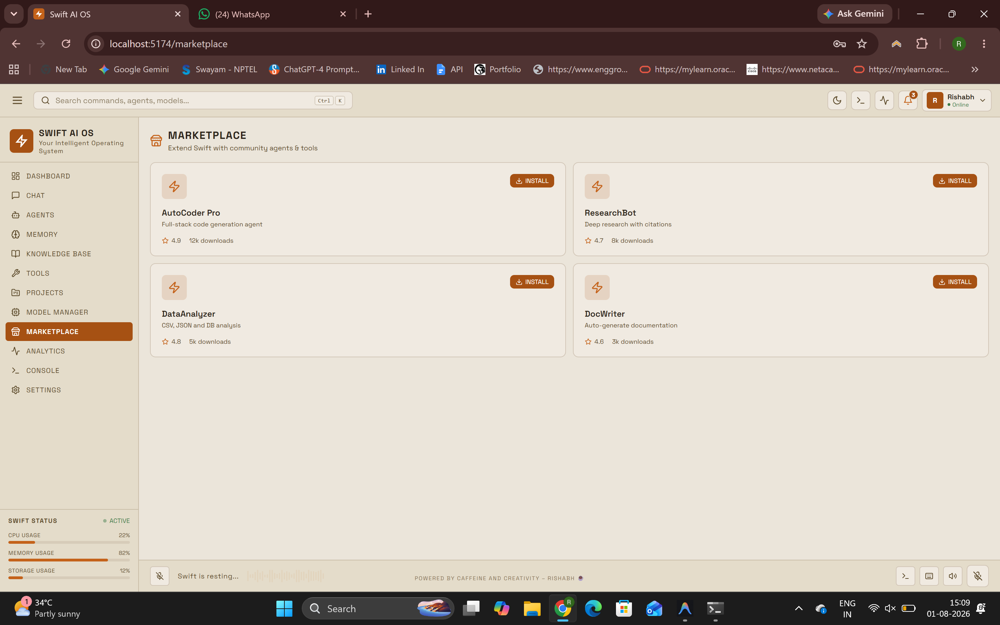
      </a>
      <p><i>Community Extension & Agent Downloads</i></p>
    </td>
    <td width="50%" align="center">
      <b>📊 Performance & Analytics</b><br/><br/>
      <a href="docs/Screenshots/analytics.png">
        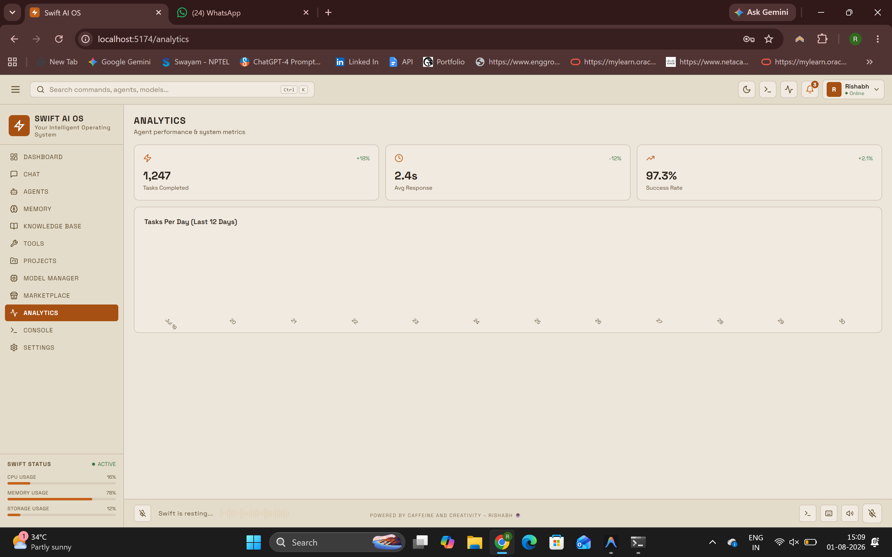
      </a>
      <p><i>Success Rates & Task Completion Charts</i></p>
    </td>
  </tr>
  <tr>
    <td width="50%" align="center">
      <b>💻 Developer Terminal Console</b><br/><br/>
      <a href="docs/Screenshots/console.png">
        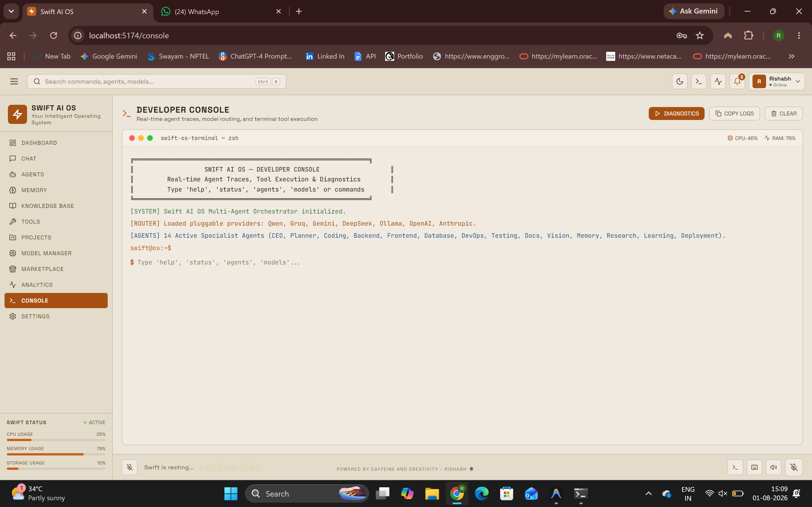
      </a>
      <p><i>Real-Time Execution Traces & Diagnostic Logs</i></p>
    </td>
    <td width="50%" align="center">
      <b>⚙️ Provider Settings & API Keys</b><br/><br/>
      <a href="docs/Screenshots/settings.png">
        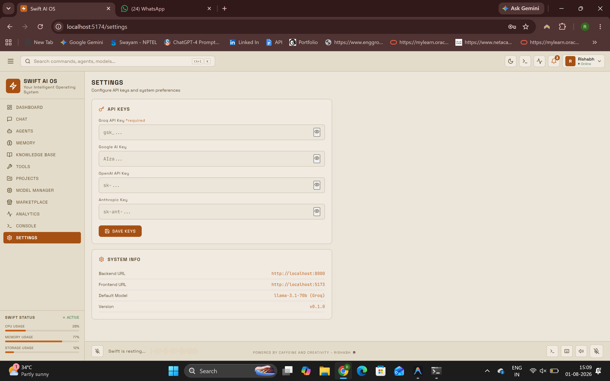
      </a>
      <p><i>Provider API Keys & System Preferences</i></p>
    </td>
  </tr>
</table>

</div>

---


## 👤 Developer & Maintainer

- **Developer**: **Rishabh** ([@rishabhtcodes](https://github.com/rishabhtcodes))
- **Project**: **Swift AI OS**
- **License**: **Personal / Non-Commercial Use Only**

---

<div align="center">

*Built with passion, caffeine, and modern AI engineering by Rishabh.* ⚡

</div>

