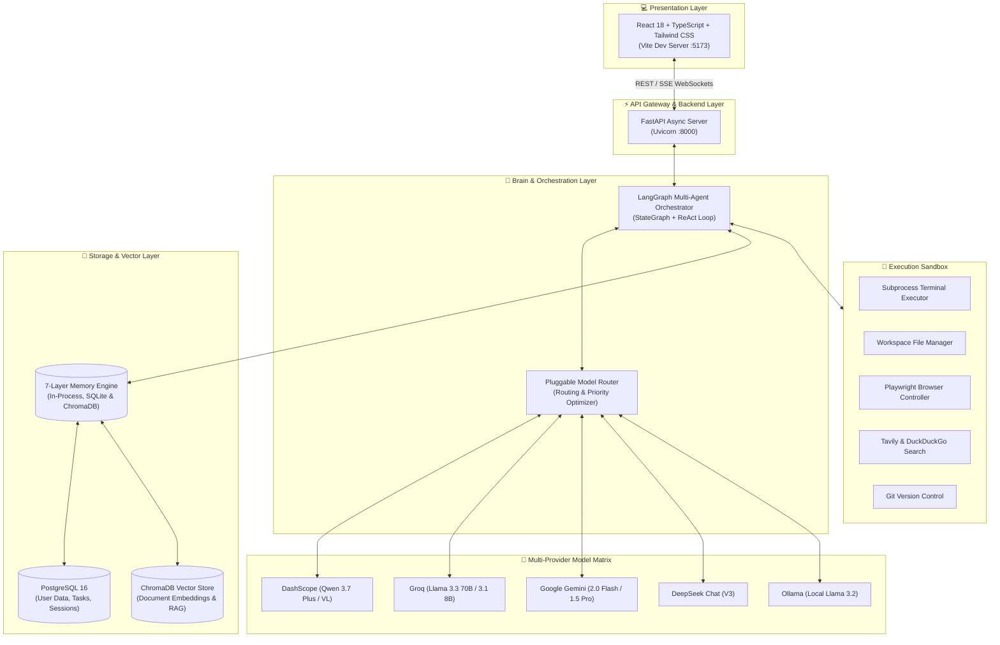
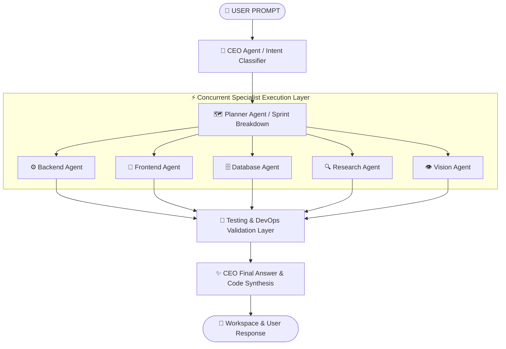

# 🏛️ Swift AI OS Architecture Specification

## 1. System Architecture Overview

**Swift AI OS** is designed as a modular, asynchronous, multi-agent AI operating system. The system decouples the presentation layer from the execution orchestrator, memory engines, and pluggable LLM routers.

---

## 2. Multi-Agent Orchestration Flow

The core brain relies on **LangGraph StateGraph** to direct messages across 14 specialist agents concurrently:

---

## 3. Core Component Definitions

| Component | Technology | Role & Function |
|---|---|---|
| **Frontend UI** | React 18, TypeScript, TailwindCSS | User interface, real-time agent telemetry, settings manager |
| **Backend REST API** | Python 3.12, FastAPI, Pydantic v2 | API gateway, WebSocket streaming, task scheduling |
| **Agent Orchestrator** | LangGraph, LangChain | Multi-agent execution loop, state management |
| **Model Router** | Custom Python Middleware | Dynamic model selection (Qwen, Groq, Gemini, DeepSeek, Ollama) |
| **Vector DB / RAG** | ChromaDB, Sentence-Transformers | Knowledge base chunking, semantic similarity retrieval |
| **Relational Storage** | PostgreSQL 16, SQLAlchemy 2.0 Async | Persistent user accounts, project tasks, conversation histories |
